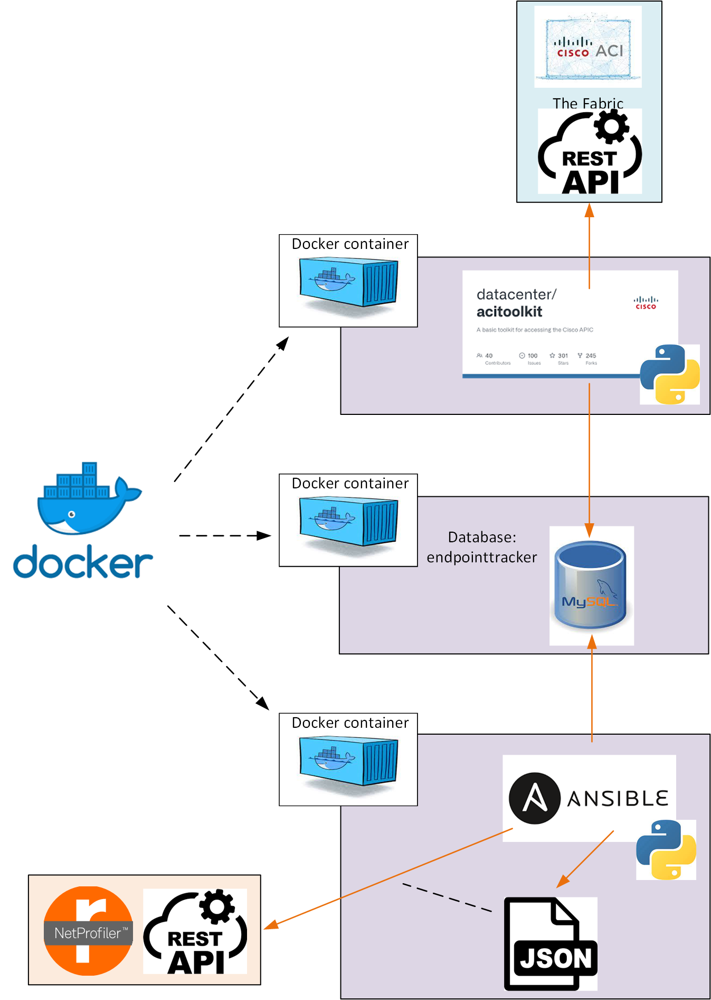

# Riverbed NPM integration with Cisco ACI 

Mapping ACI EPGs to Host Groups in Riverbed NetProfiler and Riverbed AppResponse

The following cookbook contains a description of a workflow on how to create Host Groups in **Riverbed NetProfiler** and in  **Riverbed AppResponse** based on the endpoint groups defined within a **Cisco ACI** instance.

## Workflow overview



## Prerequisites

1. A host with Docker installed, e.g. a Linux host, and sufficient access to create and run Docker containers
2. A NetProfiler instance with OAuth code credentials available for a user able to create and modify Host Groups (created via Administration > OAuth Access)
3. And/or an instances of AppResponse with credentials for a user able to manage Host Group definitions
4. Access to the source Cisco ACI APIC with suitable credentials

## Workflow description

The workflow represented above consists of the following parts:  
1. Docker container which runs the [Cisco ACI toolkit](https://developer.cisco.com/codeexchange/github/repo/datacenter/acitoolkit). 
2. Docker container which runs [MySQL](https://www.mysql.com) server.
2. Docker container which runs [Ansible](https://www.ansible.com/) and [SteelScript](https://github.com/riverbed/steelscript) which is used to configure the NetProfiler and/or AppResponse instances.

The Cisco ACI toolkit contains a script [aci_endpointtracker](https://acitoolkit.readthedocs.io/en/latest/endpointtracker.html) which extracts all the endpoints from an indicated Tenant and stores them into a MySQL table (endpoints) with the following structure:
```
MariaDB [endpointtracker]> desc endpoints;
+-----------+-----------+------+-----+---------------------+-------------------------------+
| Field     | Type      | Null | Key | Default             | Extra                         |
+-----------+-----------+------+-----+---------------------+-------------------------------+
| mac       | char(18)  | NO   |     | NULL                |                               |
| ip        | char(16)  | YES  |     | NULL                |                               |
| tenant    | char(100) | NO   |     | NULL                |                               |
| app       | char(100) | NO   |     | NULL                |                               |
| epg       | char(100) | NO   |     | NULL                |                               |
| interface | char(100) | NO   |     | NULL                |                               |
| timestart | timestamp | NO   |     | current_timestamp() | on update current_timestamp() |
| timestop  | timestamp | YES  |     | NULL                |                               |
+-----------+-----------+------+-----+---------------------+-------------------------------+
```

## Step by Step

### Step 1. Configure then environment and run docker compose

Make a copy of the file [TEMPLATE.env](TEMPLATE.env). You need to name it `.env` (so that docker compose can pick it up).

> [!NOTE]
> The .env contains the configuration that you can customize with your own values (e.g. username, passwords, ip addresses, ranges, etc.). For example, in the case the virtual network conflicts with an existing network, you can change it. The default ip range for the virtual network is 172.18.0.0/24 (see [TEMPLATE.env](TEMPLATE.env))

Then starting the `docker compose` process will build the image, create a virtual network and create the containers, as per defined in the manifest file [compose.yaml](compose.yaml), 

```shell
docker compose up -d
```

You can verify that all 3 containers are up and running:

```shell
docker ps -a
```

```log
CONTAINER ID   IMAGE                      COMMAND                  CREATED          STATUS                        PORTS     NAMES
f392b621590e   rctc-acitoolkit            "/bin/sh -c 'sleep i…"   13 minutes ago   Exited (137) 13 minutes ago             rctc-acitoolkit
ed4a3638af4c   mysql:8.0                  "docker-entrypoint.s…"   13 minutes ago   Exited (137) 13 minutes ago             rctc-mysql_db
35b3f417cdb9   rctc-steelscript-ansible   "/bin/sh -c 'sleep i…"   13 minutes ago   Exited (137) 13 minutes ago             rctc-steelscript-ansible
```

When started, the 3 containers will run indefinitely, until you stop them. To stop, run the following:

```shell
docker compose down -d
```

### Step 2. From rctc-acitoolkit, store the endpoints information to the database

The image of `rctc-acitoolkit` contains a slightly modified version of the original script `aci-endpoint-tracker.py` from the original `acitoolkit`. It fixes a couple of issues and adds a "one-off" option to force the script to execute one scan of ACI, export endpoint data into MySQL and then exit rather than running perpetually updating the database as the ACI system changes.

The following command connects to the running `rctc-acitoolkit` container to execute the Python script that gets the endpoint information and writes it in to the MySQL database:

```shell
docker exec -it rctc-acitoolkit python acitoolkit/applications/endpointtracker/aci-endpoint-tracker.py -o
```

### Step 3. From rctc-steelscript-ansible container, check the DB is reachable and populated

The following command will connect to the `rctc-steelscript-ansible` container and run a SQL statement to verify that the database exists and is now populated:

```shell
docker exec -it rctc-steelscript-ansible mysql -u root -ppassword -h mysql endpointtracker -e 'select * from endpoints limit 10;'
```

### Step 4. Configure the connector to Riverbed NetProfiler and/or AppResponse, and apply

#### NetProfiler

For **Netprofiler**, edit the file [app/create-hostgroups.yml](app/create-hostgroups.yml) and customize the NetProfiler details for your environment. For example:

```yaml
  vars:
    host: "NetProfiler IPv4 address"
    access_code: "Oauth access code"
    tenant: "myTenant"
    mysql_pass: "same value set for MYSQL_ROOT_PASSWORD in .env"
```

Then apply, running the ansible playbook for **NetProfiler** from inside the `rctc-steelscript-ansible`

```shell
docker exec rctc-steelscript-ansible ansible-playbook -vvv np-create-hostgroups.yml
```

#### AppResponse

If the **AppResponse** integration is being used, modify the [app/ar11-create-hostgroups.yml](app/ar11-create-hostgroups.yml) file with the AppResponse details for your environment (note that the AR11 integration uses password authentication rather than OAUTH).

```yaml
  vars:
    host: "AppResponse IPv4 address"
    user: "user name for a user with admin privileges"
    password: "password for above user"
    tenant: "myTenant"
    mysql_pass: "same value set for MYSQL_ROOT_PASSWORD in .env"
```

Run the ansible playbook for **AppResponse** from inside the `rctc-steelscript-ansible`

```shell
docker exec rctc-steelscript-ansible ansible-playbook -vvv ar11-create-hostgroups.yml
```

## Notes

### Running in Production

The ACI script can be run in one-off mode or in daemon mode. In one-off mode, the script pulls the endpoint data from the APIC and adds the entries matching the specified Tenant to the MySQL database.

If an endpoint entry already exists (matching MAC address) then the existing entry is updated to capture any changed details. Without one-off mode (default is now one-off mode) the application will keep running, listening for APIC events and updating the database accordingly.
In daemon mode, the application puts itself into the background.

For deployment, one could run the script chain from a cronjob or cronjobs, e.g. once an hour:
1. Run the ACI script to update the MySQL database
2. Run the Ansible script to update the Host Group definitions

It will be necessary to ensure the containers are shutdown cleanly when the system is shutdown and restarted when the system boots.

### Limitations

1. The current model only handles one Cisco ACI Tenant. The model could be extended to support multiple tenants with separate Host Group Types per Tenant, for instance.
2. The mechanism only supports creating Host Groups in one NetProfiler and/or one AppResponse; it should support multiple instances of AppResponse at least and also support Portal as this can be used to manage HG definitions across multiple AppResponse instances.

### Troubleshooting

1. Make sure that the containers are up and running
2. Make sure there really are endpoints defined in the APIC for the scripts to discover (the Cisco ACI sandbox is often empty!)
2. Make sure the access information and credentials are correct for the APIC
3. Make sure the access information and credentials are correct for the NetProfiler and/or AppResponse - note that the OAuth tokens expire so will need renewing at some point
4. If there are Python errors make sure that nothing is installed that is not compatible with the old version of Python used by the ACI toolkit (Python version 2.7)

### Reference

The [aci-endpoint-tracker](acitoolkit/applications/endpointtracker/aci-endpoint-tracker.py) script provides the following online help:

```shell
root@2085cd500c8a:/opt/acitoolkit/applications/endpointtracker# python aci-endpoint-tracker.py --help
usage: aci-endpoint-tracker.py [-h] [-u URL] [-l LOGIN] [-p PASSWORD]
                               [--cert-name CERT_NAME] [--key KEY]
                               [--snapshotfiles SNAPSHOTFILES [SNAPSHOTFILES ...]]
                               [-i MYSQLIP] [-a MYSQLLOGIN] [-s MYSQLPASSWORD]
                               [-d] [--kill] [--restart] [-o]

Application that logs on to the APIC and tracks all of the Endpoints in a MySQL database.

optional arguments:
  -h, --help            show this help message and exit
  -u URL, --url URL     APIC URL e.g. http://1.2.3.4
  -l LOGIN, --login LOGIN
                        APIC login ID.
  -p PASSWORD, --password PASSWORD
                        APIC login password.
  --cert-name CERT_NAME
                        X.509 certificate name attached to APIC AAA user
  --key KEY             Private key matching given certificate, used to
                        generate authentication signature
  --snapshotfiles SNAPSHOTFILES [SNAPSHOTFILES ...]
                        APIC configuration files
  -i MYSQLIP, --mysqlip MYSQLIP
                        MySQL IP address.
  -a MYSQLLOGIN, --mysqllogin MYSQLLOGIN
                        MySQL login ID.
  -s MYSQLPASSWORD, --mysqlpassword MYSQLPASSWORD
                        MySQL login password.
  -d, --daemon          Run as a Daemon
  --kill                if run as a process, kill it
  --restart             if run as a process, restart it
  -o, --oneoff          Run one pass only and exit
```

### Build manually

You can build the container images manually. Each image has its own Dockerfile: [steelscript-ansible](Dockerfile.steelscript-ansible), [acitoolkit](Dockerfile.acitoolkit).

To build, run the following commands:

```shell
docker build -t steelscript-ansible:latest -f Dockerfile.steelscript-ansible .

docker build -t acitoolkit:latest -f Dockerfile.acitoolkit .
```

Then you can list the images on your host to verify the images `rctc-steelscript-ansible` and `rctc-acitoolkit` are there:

```shell
docker images rctc*
```

### Modify the compose file

Some prefer hardcoding secret and password in cleartext in the compose. It is not recommended but you can do it. 
In the [compose](compose.yaml), for example you can hard-code the value of the environment variables APIC_URL, APIC_LOGIN and APIC_PASSWORD:

```yaml
   environment:
      - APIC_URL=https://myapic.url
      - APIC_LOGIN=my_admin_login
      - APIC_PASSWORD=my_password
```

## License

Copyright (c) 2021-2024 Riverbed Technology, Inc.

The scripts provided here are licensed under the terms and conditions of the MIT License accompanying the software ("License"). The scripts are distributed "AS IS" as set forth in the License. The script also include certain third party code. All such third party code is also distributed "AS IS" and is licensed by the respective copyright holders under the applicable terms and conditions (including, without limitation, warranty and liability disclaimers) identified in the license notices accompanying the software.
